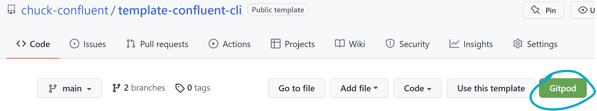

# Tips for Gitpod Users

Here are some tips for having a great Gitpod experience!

## Open A Service in a New Tab

Your Gitpod workspace might be running some HTTP services on different ports. You can open those services in a new tab and Gitpod will send you to a special URL where they are proxying the service for you.

For example, you may be running a GUI app on port 9021:
1. You can click the "Remote Explorer" tab on the left menu to bring up the active ports.
1. You hover over port 9021 and click the globe icon to open up that service in a new tab.
1. You'll be taken to a URL like `9021-blahblahblah.gitpod.io` where Gitpod is proxying the service for you.
1. The URL is probably public, which means you'll be able to share the link with a friend and they can play around with that GUI app with you

## Copy/Paste

Gitpod lets to copy/paste from/to the terminal, which is great! However, each workspace has a unique URL, so you might be asked to allow access to the clipboard A LOT. Fortunately, you can allow clipboard access for all Gitpod workspaces!

Here are some directions for Chrome, but the steps for other browsers are in the [Gitpod docs](https://www.gitpod.io/docs/configure/browser-settings):

1. Go to [chrome://settings/content/clipboard](chrome://settings/content/clipboard)
1. Click "Add"
1. Add the pattern `[*.]gitpod.io`

Now all your Gitpod workspaces can use the clipboard!

## Secret Environment Variables

You may want some secrets to show up securely in your workspace. For example, you may want a Confluent Cloud API key to be available in the workspace. Go to https://gitpod.io/variables and add an environment variable scoped to the repo you want to use. These secret environment variables are encrypted at rest and are securely attached to your workspace on launch.

WARNING: If you share your workspace with someone, they will be able to see the environment variables in that workspace.

## Use the Gitpod Browser Extension to More Easily Launch Workspaces

Gitpod has a [browser extension](https://www.gitpod.io/docs/browser-extension#browser-extension) that adds a button on repos so you can more quickly launch a workspace for that repo. It will look like this:

